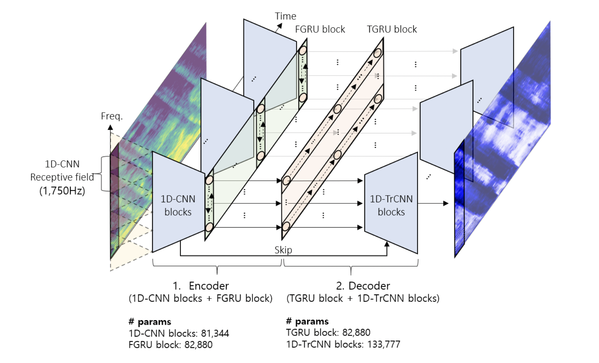

# REAL-TIME DENOISING AND DEREVERBERATION WITH TINY RECURRENT U-NET


Unofficial implementation of [REAL-TIME DENOISING AND DEREVERBERATION WTIH TINY RECURRENT U-NET](https://arxiv.org/pdf/2102.03207.pdf) in PyTorch. Tiny Recurrent U-Net (TRU-Net) is a lightweight online inference model that matches the performance of current (23 Jun 2021) state-of-the-art models. The size of the quantized version of TRU-Net is 362 kilobytes (~300k parameters), which is small enough to be deployed on edge devices. In addition, the small-sized model with a new masking method called phase-aware β-sigmoid mask enables simultaneous denoising and dereverberation.

Colab notebook: [](https://colab.research.google.com/drive/1jd9J3lLSZrmz3hBd372NPV_9u7JQjoX-#scrollTo=9t0DwRNxeRhp)

## Requirements

Create and activate a virtual environment and install dependencies.

```
pip install -r requirements.txt
```

## Dataset

- The code uses [Microsoft DNS 2020](https://arxiv.org/ftp/arxiv/papers/2005/2005.13981.pdf) dataset. The dataset, pre-processing codes, and instruction to generate training data can be found in [this link](https://github.com/microsoft/DNS-Challenge/tree/interspeech2020/master). Assume the dataset is stored under ```./dns```. Prior to generating clean-noisy data pairs, to comply with the paper's configurations, alter the following parameters in their ```noisyspeech_synthesizer.cfg``` file: 
```
total_hours: 300, 
snr_lower: -5, 
snr_upper: 25, 
total_snrlevels: 30
```


```
Training set directory: 
./training_dataset/clean/fileid_{0..10000}.wav
./training_dataset/noisy/fileid_{0..10000}.wav
./training_dataset/noise/fileid_{0..10000}.wav
```

Generate training data: 
```
python noisyspeech_synthesizer_singleprocess.py
```

Now we assume that the structure of the dataset folder is:
```
Training set: 
.../dns/training_set/clean/fileid_{0..49999}.wav
.../dns/training_set/noisy/fileid_{0..49999}.wav
.../dns/training_set/noise/fileid_{0..49999}.wav
```

## Training

The ```tiny.json``` file complies with the paper's configurations. Should you wish to initiate training with a different set of configurations, create ```.json``` file in the ```configs``` directory or simply modify the paramteres in the pre-existing file. We recommend leaving the network hyperparameters untouched if faithfull replication of the model size is intended. To initiate training run:

```
python3 distributed.py -c config/tiny.json
```

The model recieves data with shape of (Time-step, 4, Frequency) where dimension one encomapasses a channel-wise concatenation of log-magnitude spectrogram, PCEN spectrogram, and real/imaginary part of demodulated phase respectively. To compensate memory over-load, our code utilises the aforementiond data information to reconstruct time-domain audio in order to calculate Multi-Resolution STFT Loss instead loading audio file pairs on the GPU.


## Denoising


## Evaluation


## Export as onnx
Run the script below to export the trained model in onnx format:
```
python onnx.py -c 'PATH_TO_JSON_CONGIF' -i 'PATH_TO_TRAINED_MODEL_CKPT' -o 'ONNX_EXPORT_PATH'
```
